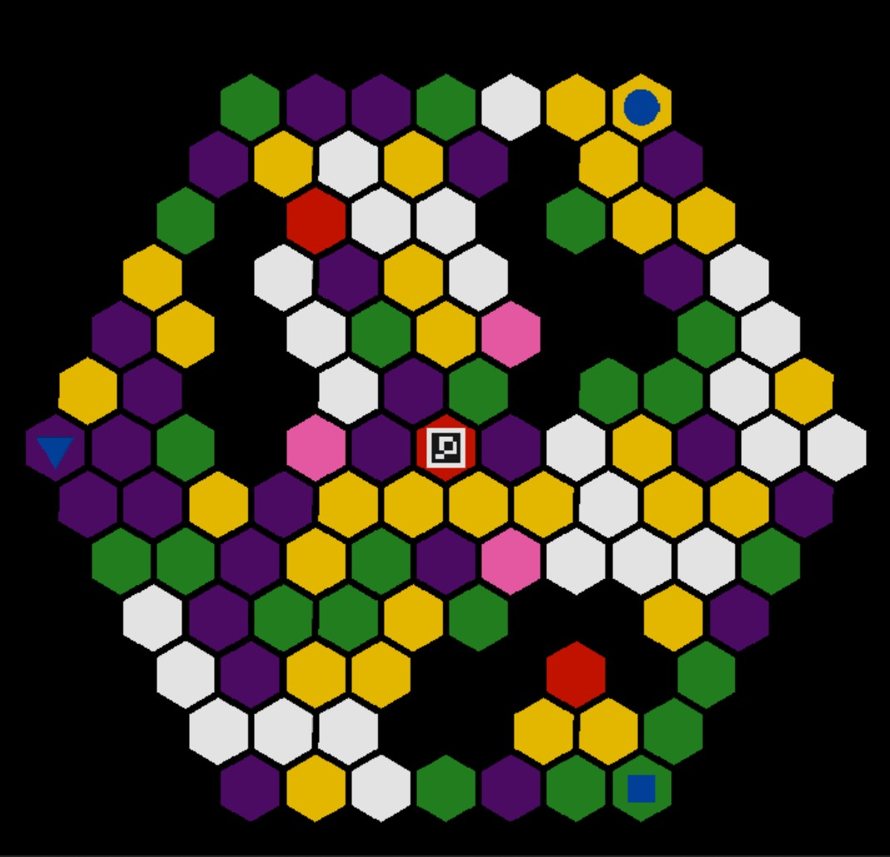
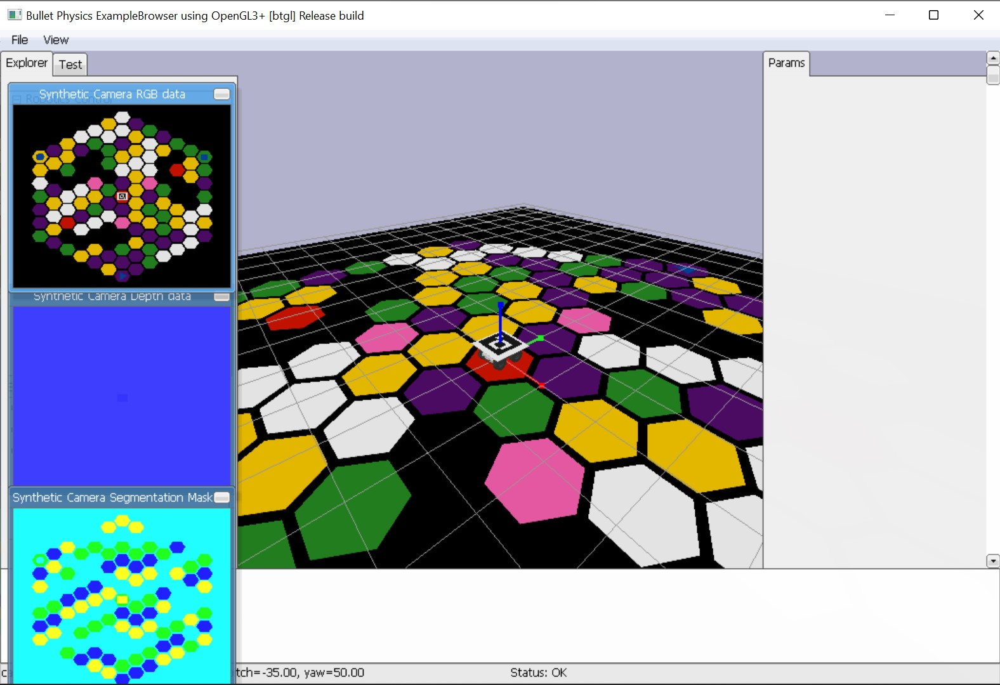
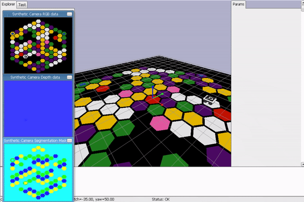
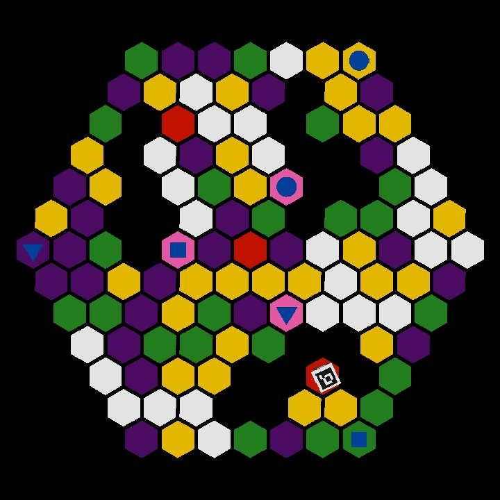
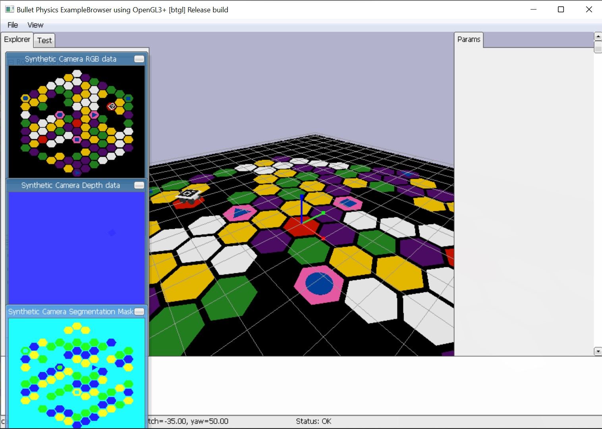

### Overview
Herein, I have developed a python project based on the Dijkstra Algorithm. It uses it to move a robot in pybullet to travel from one hexagon to another through the path with the minimum damage.

To run this file, open command prompt and type the following command ->

```
"path_to_this folder"/pixelate_arena/pixelate_arena/envs> pip install -e pix_arena.py
```
### About 
It is 100% python based project.
Libraries used - OpenCV, Numpy, math, gym, pybullet, collections

### Task
* Starts at one of red hexagons.

        


* It moves from there to the closest of the other two red hexagons which it calculates using the dijkstra algorithm.


* From there, it moves to the third red hexagons.

    
  

* On reaching the third red hexagon, the pink plates reveal the shapes in them i.e. basically unlocks them.

        
  

* Now, it moves to the pink tiles in any order i.e. triangle, square, circle or anything.

* The thing to be noticed is that it moves to already present shaped hexagons in the same order that it followed on the pink tiles. For eg - if on the pink tiles it followed the order triangle, square, circle then it would travel to the non-pink hexagons containing shapes in the same order which means first to the triangle, then square followed by circle. 

### Requirements
All the required python libraries are mentioned in requirements.txt